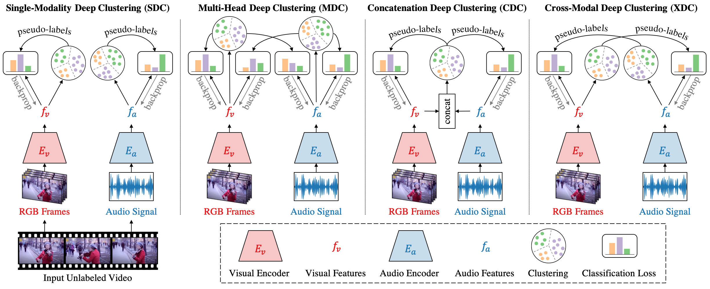

[](https://paperswithcode.com/sota/self-supervised-action-recognition-on-ucf101?p=self-supervised-learning-by-cross-modal-audio)
[](https://paperswithcode.com/sota/self-supervised-action-recognition-on-hmdb51?p=self-supervised-learning-by-cross-modal-audio)
[](https://paperswithcode.com/sota/audio-classification-on-esc-50?p=self-supervised-learning-by-cross-modal-audio)
[](https://paperswithcode.com/sota/audio-classification-on-dcase?p=self-supervised-learning-by-cross-modal-audio)

# Self-Supervised Learning by Cross-Modal Audio-Video Clustering
[[Paper]](https://arxiv.org/pdf/1911.12667.pdf)
[[Project Website]](http://humamalwassel.com/publication/xdc/)

This repository holds the pretrained models for the Cross-Modal Deep Clustering (XDC) method presented as a **_spotlight_** in NeurIPS 2020.

**Self-Supervised Learning by Cross-Modal Audio-Video Clustering.**
Humam Alwassel, Dhruv Mahajan, Bruno Korbar, Lorenzo Torresani, Bernard Ghanem, Du Tran. In *NeurIPS*, 2020.



# Load Pretrained Models 

We provide the following pretrained R(2+1)D-18 video models. We report the average top-1 video-level accuracy over all splits on UCF101 and HMDB51 after full-finetuning.

| Pretraining Name               | Description                    | UCF101 | HMDB51 | Weights |
| -----------------------------  | ------------------------------ | ------ | ------ | --------|
| `r2plus1d_18_xdc_ig65m_kinetics` | XDC pretrained on IG-Kinetics  | 95.5 | 68.9 | [[PyTorch]](https://github.com/HumamAlwassel/XDC/releases/download/model_weights/r2plus1d_18_xdc_ig65m_kinetics-f24f6ffb.pth) [[Caffe2]](https://github.com/HumamAlwassel/XDC/releases/download/model_weights/r2plus1d_18_xdc_ig65m_kinetics-3ece601e.pkl)|
| `r2plus1d_18_xdc_ig65m_random`   | XDC pretrained on IG-Random    | 94.6 | 66.5 | [[PyTorch]](https://github.com/HumamAlwassel/XDC/releases/download/model_weights/r2plus1d_18_xdc_ig65m_random-189d23f4.pth) [[Caffe2]](https://github.com/HumamAlwassel/XDC/releases/download/model_weights/r2plus1d_18_xdc_ig65m_random-dcd2dc42.pkl)|
| `r2plus1d_18_xdc_audioset`       | XDC pretrained on AudioSet     | 93.0 | 63.7 | [[PyTorch]](https://github.com/HumamAlwassel/XDC/releases/download/model_weights/r2plus1d_18_xdc_audioset-f29ffe8f.pth) [[Caffe2]](https://github.com/HumamAlwassel/XDC/releases/download/model_weights/r2plus1d_18_xdc_audioset-6508c8a5.pkl)|
| `r2plus1d_18_fs_kinetics`        | fully-supervised pretraining on Kinetics | 94.2 | 65.1 | [[PyTorch]](https://github.com/HumamAlwassel/XDC/releases/download/model_weights/r2plus1d_18_fs_kinetics-622bdad9.pth) [[Caffe2]](https://github.com/HumamAlwassel/XDC/releases/download/model_weights/r2plus1d_18_fs_kinetics-1b1f26af.pkl)|
| `r2plus1d_18_fs_imagenet`        | fully-supervised pretraining on ImageNet | 84.0 | 48.1 | [[PyTorch]](https://github.com/HumamAlwassel/XDC/releases/download/model_weights/r2plus1d_18_fs_imagenet-ff446670.pth) [[Caffe2]](https://github.com/HumamAlwassel/XDC/releases/download/model_weights/r2plus1d_18_fs_imagenet-0ee8b845.pkl)|

There are two ways to load the XDC pretrained models in PyTorch: (1) via PyTorch Hub or (2) via source code.

### Via PyTorch Hub (Recommended)

> :warning: _**[Known Issue] Using this way to load XDC models breaks for torchvision v0.13 or higher due to backward incompatible changes introduced in torchvision.** Please make sure to use trochvision v0.12 or earlier when loading XDC models via the `torch.hub.load()` API. Loading models via source code still works as expected._

You can load all our pretrained models using `torch.hub.load()` API.
```
import torch

model = torch.hub.load('HumamAlwassel/XDC', 'xdc_video_encoder', 
                        pretraining='r2plus1d_18_xdc_ig65m_kinetics',
                        num_classes=42)
```

Use the parameter `pretraining` to specify the pretrained model to load from the table above (default pretrained model is `r2plus1d_18_xdc_ig65m_kinetics`). Pretrained weights of all layers except the FC classifier layer are loaded. The FC layer (of size `512 x num_classes`) is randomly-initialized. Specify the keyword argument `num_classes` based on your application (default is 400).
Run `print(torch.hub.help('HumamAlwassel/XDC', 'xdc_video_encoder'))` for the model documentation. Learn more about PyTorch Hub [here](https://pytorch.org/hub/). 

### Via Source Code

Clone this repo and create the conda environment.
```
git clone https://github.com/HumamAlwassel/XDC.git
cd XDC
conda env create -f environment.yml
conda activate xdc
```

Load the pretrained models from the file `xdc.py`.
```
from xdc import xdc_video_encoder

model = xdc_video_encoder(pretraining='r2plus1d_18_xdc_ig65m_kinetics',
                          num_classes=42)
```

# Feature Extraction and Model Finetuning

Please refer to the Facebook Video Model Zoo (VMZ) [repo](https://github.com/facebookresearch/VMZ) for PyTorch/Caffe2 scripts for feature extraction and model finetuning on datasets such as UCF101 and HMDB51.

Please cite this work if you find XDC useful for your research.
```
@inproceedings{alwassel_2020_xdc,
  title={Self-Supervised Learning by Cross-Modal Audio-Video Clustering},
  author={Alwassel, Humam and Mahajan, Dhruv and Korbar, Bruno and 
          Torresani, Lorenzo and Ghanem, Bernard and Tran, Du},
  booktitle={Advances in Neural Information Processing Systems (NeurIPS)},
  year={2020}
}
```
